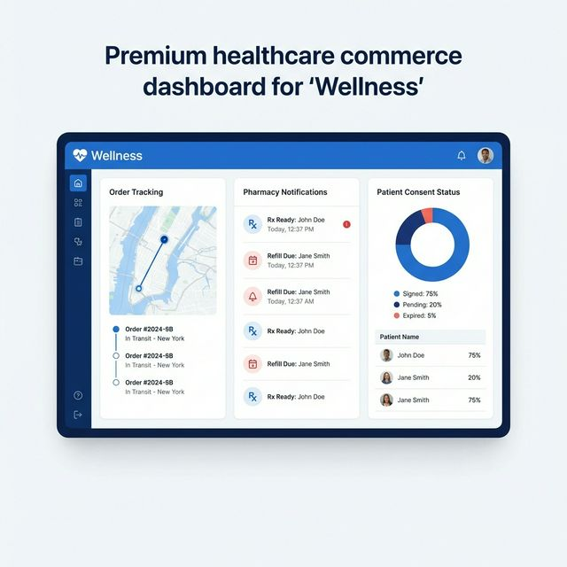
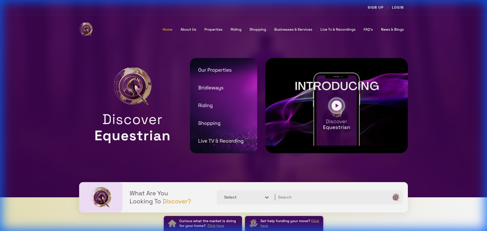
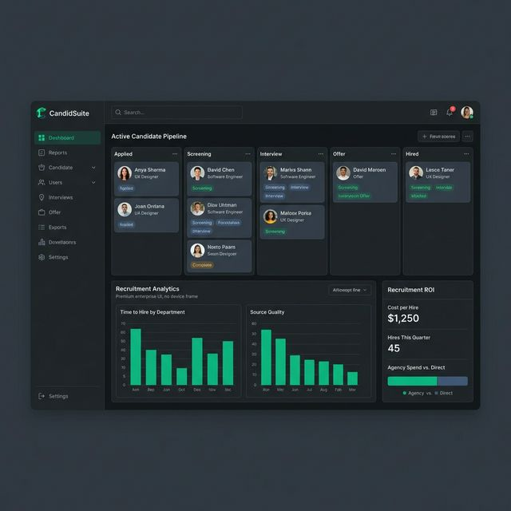

# Yash Vaddi | Senior Frontend Engineer 🚀

**Architecting Scalable Micro Frontend Ecosystems & High-Performance Enterprise Solutions**

---

### 👋 Engineering Profile
I am a **Senior Frontend Engineer** with **3.2 years of experience** specializing in **Micro Frontend (MFE) Architecture**, high-performance **Next.js/React** applications, and polyglot backend orchestration. I have a proven track record of delivering 10+ enterprise-grade applications, focusing on developer autonomy, sub-second performance, and strict security compliance (HIPAA/SOC2).

---

### 🚀 High-Impact Engineering Capabilities

- **Micro Frontend Orchestration**: Expert at designing and implementing Module Federation hosts and remote modules for massive scale.
- **FinTech & Payments**: Integrated multi-gateway systems including **Stripe** and **Authorize.net** for $1M+ yacht transactions.
- **Real-Time Engines**: Built low-latency dashboards using **Socket.IO**, **WebRTC**, and custom Web Workers.
- **3D & Visualization**: Leveraged **Three.js** and **Konva.js** for interactive 3D property viewports and canvas-based structural builders.
- **Compliance & Security**: Engineered PHI-safe healthcare systems with end-to-end AES-256 encryption and HIPAA-compliant API interceptors.

---

### 📁 Micro Frontend Portfolio (Project MFEs)

Each module below is an independent Micro Frontend, demonstrating deep integration with diverse backend ecosystems.

#### 🏥 [Wellness - Healthcare Portal](./projects/wellness) 

  

- **Stack**: Next.js 14 • NestJS • HIPAA Interceptors
- **Highlight**: Secure Patient Health Portal with encrypted document management and real-time health scoring.

#### 🚢 [BoatDox - Maritime Transactions](./projects/boatdox) 

  

- **Stack**: React • Java Spring Boot • Stripe & Authorize.net
- **Highlight**: Multi-gateway payment system for high-value vessel deposits and maritime legal documentation.

#### 🐎 [Discover Equestrian - 3D Real Estate](./projects/discover-equestrian) 

  

- **Stack**: Next.js • Go (Golang) • Three.js 3D Engine
- **Highlight**: Immersive 3D estate visualization and high-performance geospatial property search.

#### 📊 [Sales CRM - Real-Time Communications](./projects/sales-crm) 

  

- **Stack**: Next.js • Python FastAPI • Socket.IO
- **Highlight**: Drag-and-drop lead pipeline with optimistic UI updates and real-time WhatsApp Business API synchronization.

#### 💼 [CandidSuite - Enterprise ATS](./projects/candidSuite) 

  

- **Stack**: Next.js • PHP Laravel • Gmail Bridge
- **Highlight**: Advanced interview pipeline orchestrator with ROI tracking and cross-platform email synchronization.

#### 🏠 [Nuway Roofing - Structural Builder](./projects/nuway-roofing) 

  

- **Stack**: React • .NET Core 8 • Konva.js
- **Highlight**: Real-time canvas-based structural builder for insurance claim estimation.

#### ⚡ [Core Utilities - WASM Engine](./projects/core-utilities) 

  

- **Stack**: Next.js • Rust (WASM) • Web Workers
- **Highlight**: High-performance client-side encryption and image compression engine.

---

### 🛠️ Core Tech Stack
| Category | Technologies |
| :--- | :--- |
| **Orchestration** | **Module Federation**, Docker Compose, Nginx Reverse Proxy |
| **Frontend** | **Next.js 14**, **React**, TypeScript, Redux Toolkit, Framer Motion |
| **Backend Sync** | Node.js (Nest), Python (FastAPI), Go, Laravel, .NET |
| **Real-Time** | **Socket.IO**, WebRTC, Server-Sent Events (SSE) |
| **Graphics** | **Three.js**, **Konva.js**, SVG Animation, WebGL |
| **Testing** | **Jest**, React Testing Library, Playwright |

---

### 🚢 Deployment & CI/CD
This entire ecosystem is containerized for production parity across any environment.
- **Docker Orchestration**: `docker-compose up --build` launches the entire portfolio.
- **MFE CI/CD**: Independent GitHub Actions for each project, ensuring zero-downtime remote module updates.

---

### 📫 Contact
- **Email:** [yashvaddi@gmail.com](mailto:yashvaddi@gmail.com)
- **Phone:** +91 7600158762
- **Location:** Ahmedabad, Gujarat, India (Open to Remote / Relocation)

---

Built with ❤️ and Precision Engineering

