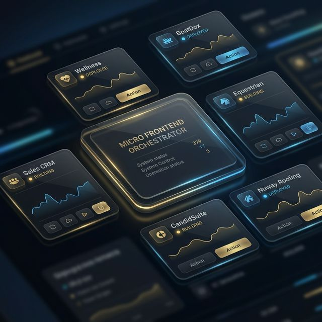

# MFE Shell - Micro Frontend Orchestrator 🌐

[](https://github.com/Yashvaddi/Profile/actions/workflows/mfe-shell-ci.yml)

The **MFE Shell** is the central heart of the portfolio ecosystem. It acts as the **Host Application** that orchestrates multiple Micro Frontends (Remotes), providing a unified user experience, shared authentication, and global state management.

---

## 📸 Preview

*MFE Shell - Unified Portfolio Dashboard*

---

## 🚀 Technical Highlights
- **Framework:** **Next.js 14** with App Router for seamless orchestration.
- **Micro Frontend Engine:** Leverages **Module Federation** (or dynamic injection) for runtime module loading.
- **Shared State Bridge:** A lightweight communication layer for syncing data across MFEs.
- **Global Layout:** Unified navigation and theme system across all remote projects.
- **Security:** Centralized authentication and authorization gateway.

---

## 🛠️ Project Structure
```text
mfe-shell/
├── public/                 # Global assets and shell screenshots
├── src/
│   ├── components/         # Shell-specific components (Navigation, Sidebar)
│   ├── hooks/              # Global hooks for MFE orchestration
│   ├── services/           # Authentication and MFE Registry services
│   ├── styles/             # Global design system (Tailwind)
│   └── utils/              # MFE loaders and bridge utilities
├── next.config.js          # Module Federation configuration
└── tsconfig.json
```

---

## ✨ Key Features
- **Dynamic MFE Loading**: Discovers and mounts remote modules at runtime based on the registry.
- **Shared Context**: Common services (Auth, Logging) shared across all projects.
- **Unified Branding**: Ensures a consistent look and feel across diverse technologies.
- **Responsive Layout**: Orchestrates mobile vs desktop views for all sub-projects.

---

## 🧪 Testing Coverage (Jest)
- **Registry Logic**: Ensuring remote MFEs are correctly registered and resolved.
- **Bridge Reliability**: Validating data transmission between host and remotes.
- **Layout Integrity**: UI tests for core shell navigation and responsiveness.

---

## 🛡️ Role & Contributions
- Designed and implemented the **Micro Frontend Orchestration** strategy.
- Built the **MFE Registry Service**, allowing for independent deployment of sub-projects.
- Engineered the **Shared State Bridge**, enabling low-coupling communication between remotes.
- Optimized the shell's **Performance** to ensure sub-second initial load times despite multiple remotes.
