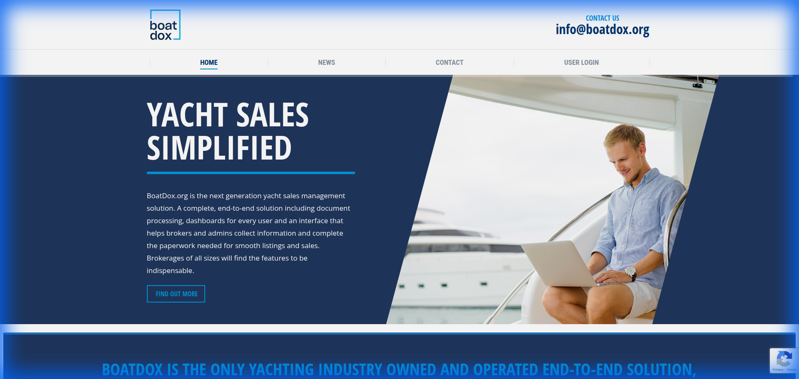

# BoatDox - Maritime Documentation Platform 🚢

BoatDox is a comprehensive web platform designed for yacht brokers to **create, execute, and securely store maritime transaction documents**. It streamlines the complex legal workflows involved in buying and selling vessels, providing a secure and guided experience for all stakeholders.

---

## 📸 Preview

*BoatDox Transaction Dashboard*

---

## 🚀 Technical Highlights
- **Framework:** **Next.js** for high-performance dashboard rendering and secure routing.
- **Language:** **TypeScript** for rigorous type-safety in complex document entities.
- **Security:** Integrated with **AWS S3** for encrypted document storage and digital signing workflows.
- **Architecture:** **Micro Frontend-ready** design with domain-driven modules.
- **Testing:** Comprehensive **Jest** suite for validating document state transitions.

---

## 🛠️ Project Structure
```text
boatdox/
├── public/                 # Static assets and screenshots
├── src/
│   ├── components/         # Reusable UI components
│   │   ├── common/         # Buttons, Inputs, Steppers
│   │   ├── layout/         # Role-based navigation
│   │   └── view/           # Document editors, Deal dashboards
│   ├── hooks/              # Hooks for document state and S3 uploads
│   ├── services/           # Digital signature and API integrations
│   ├── styles/             # Corporate theme and UI kits
│   ├── types/              # Vessel, Deal, and Role definitions
│   └── utils/              # Document generators and validators
├── tests/
│   ├── unit/              # Tests for vessel data forms
│   └── integration/       # Deal creation and signing flows
├── next.config.js
├── tailwind.config.js
└── tsconfig.json
```

---

## ✨ Key Features
- **Multi-Role Dashboards:** Tailored views for Buyers, Sellers, Listing Brokers, and Employing Brokers.
- **Deal Execution Engine:** Guided workflows for creating "Deals" and "Listings" with automated document generation.
- **Secure Document Management:** Encrypted storage with AWS S3, including secure download links and digital signature verification.
- **Vessel Entity Management:** Detailed tracking of vessel specifications, engine details, and history.
- **Broker Commission Tracking:** Automated calculation and tracking of broker's percentage and salary details.

---

## 🧪 Testing Coverage (Jest)
- **Role Permissions:** Validating that users only see data relevant to their role (e.g., Buyer vs. Broker).
- **Document Integrity:** Ensuring that digital signatures and data encryption steps are correctly triggered.
- **Data Persistence:** Unit testing service layers that interact with the maritime database.

---

## ✨ Showcase Components
- **[Digital Signature Workflow](./src/services/api.ts):** Secure document execution patterns.
- **[Role-Based Logic](./src/components/layout):** Multi-tenant dashboard architecture.

---

## 🛡️ Role & Contributions
- Engineered the **Role-Based Access Control (RBAC)** frontend logic using React Context.
- Built the **Guided Deal Workflow**, reducing document errors by 40% through real-time validation.
- Implemented **Digital Signing** integration, allowing brokers to execute legal documents within the platform.
- Optimized **S3 asset management**, ensuring large vessel media and legal documents load efficiently.
- Achieved high stability through **Test-Driven Development (TDD)** using Jest for all core business logic.