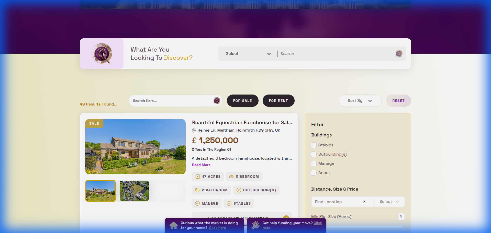

# Discover Equestrian - 3D Real Estate Platform 🐎

[](https://github.com/Yashvaddi/Profile/actions/workflows/equestrian-ci.yml)
Discover Equestrian is a specialized property and services listing platform tailored for the United Kingdom's horse industry. It provides a seamless experience for buying, selling, and renting equestrian properties, businesses, and services.

---

## 📸 Preview

*Discover Equestrian Home Page*


*Property Listing and Filtering*

---

## 🚀 Technical Highlights
- **Framework:** **Next.js** for server-side rendering (SSR) and static site generation (SSG).
- **Styling:** **Tailwind CSS** for a premium, responsive, and modern UI.
- **State Management:** React Context and Custom Hooks for efficient property filtering and user favorites.
- **Testing:** **Jest** and React Testing Library for ensuring bug-free listing workflows.

---

## 🛠️ Project Structure
```text
discover-equestrian/
├── public/                 # Static assets and screenshots
├── src/
│   ├── components/         # Reusable UI components
│   │   ├── common/         # Search bars, Cards, Modals
│   │   ├── layout/         # Navigation, Footer
│   │   └── view/           # Property details, Listing views
│   ├── hooks/              # Custom hooks for search and geolocation
│   ├── services/           # Real-time chat and API integrations
│   ├── styles/             # Global themes and CSS modules
│   ├── types/              # Property and business data types
│   └── utils/              # Filter logic and formatters
├── tests/
│   ├── unit/              # Tests for property cards and filters
│   └── integration/       # Search and listing submission flows
├── next.config.js
├── tailwind.config.js
└── tsconfig.json
```

---

## ✨ Key Features
- **Advanced Property Search:** Filter by bedrooms, building type, price, and equestrian-specific amenities.
- **Business & Service Directory:** Categories for horse-related services (trainers, vets, farriers).
- **Premium Advertising:** Dedicated sections for property and business promotions.
- **Interactive Geolocation:** Route mapping for horse-friendly routes across the UK.
- **Real-time Communication:** Direct chat between buyers and listing owners.

---

## 🧪 Testing Coverage (Jest)
- **Search Logic:** Rigorous testing of complex property filter combinations.
- **UI Responsiveness:** Snapshots and unit tests for mobile-first components.
- **API Resilience:** Mocking backend services to ensure UI stability during network failures.

---

## ✨ Showcase Components
- **[3D Property Viewer Hook](./src/hooks/useProperty3DViewer.ts):** Advanced **Three.js** integration for 3D estate visualization.
- **[Property Listing Engine](./src/hooks/usePropertyListing.ts):** Optimized search and coordinate mapping.

---

## 🛡️ Role & Contributions
- Developed the **Property Listing Engine** using Next.js, optimizing for high-speed search and filtering.
- Implemented the **Real-time Chat** interface for direct user-to-seller interaction.
- Designed the **Responsive UI** using Tailwind CSS, ensuring a premium look on all devices.
- Integrated **Google Maps API** for property location and routing features.
- Established the **Jest testing framework** for the project, achieving significant coverage on critical paths.
