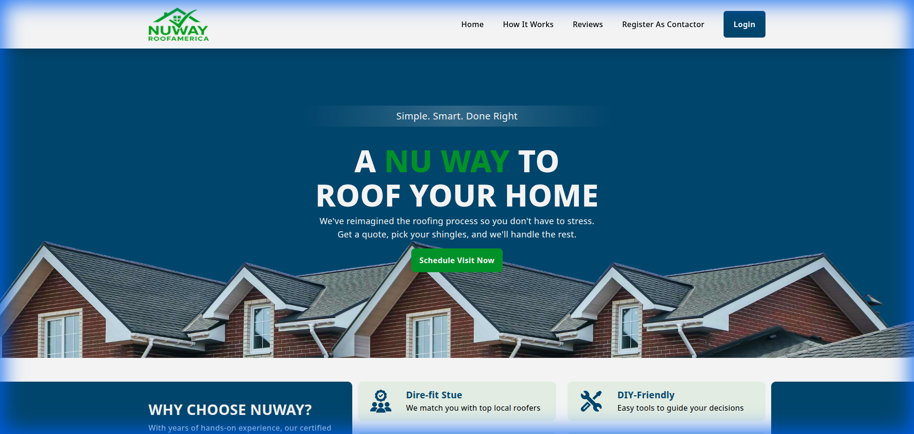

# Nuway Roofing - Roofing Solutions Platform 🏠

[](https://github.com/Yashvaddi/Profile/actions/workflows/nuway-ci.yml)


Nuway Roofing is a comprehensive solution for the US roofing industry, automating the connection between contractors, insurance companies, and customers. It transforms the manual, complex process of roofing installation, repair, and maintenance into a fully automated digital workflow.

---

## 📸 Preview

*Nuway Roofing Landing Page*

---

## 🚀 Technical Highlights
- **Framework:** **Next.js** for high SEO performance and server-side rendering of project portals.
- **Language:** **TypeScript** for consistent data modeling across insurance and contractor entities.
- **Real-time Engine:** Integrated **Socket.IO** for live project status updates and coordination.
- **Testing:** **Jest** for validating quotation logic and insurance claim calculations.
- **Performance:** Optimized for mobile-first usage by contractors in the field.    

---

## 🛠️ Project Structure
```text
nuway-roofing/
├── public/                 # Static assets and screenshots
├── src/
│   ├── components/         # Reusable UI components
│   │   ├── common/         # Forms, Status Badges, Charts
│   │   ├── layout/         # Customer vs Contractor portals
│   │   └── view/           # Inspection reports, Quote editors
│   ├── hooks/              # Custom hooks for real-time sync
│   ├── services/           # Insurance API and Payment services
│   ├── styles/             # Tailwind theme for roofing brand
│   ├── types/              # Contractor, Customer, and Claim types
│   └── utils/              # Cost calculators and PDF generators
├── tests/
│   ├── unit/              # Tests for cost calculation logic
│   └── integration/       # Workflow from inspection to assignment
├── next.config.js
├── tailwind.config.js
└── tsconfig.json
```

---

## ✨ Key Features
- **End-to-End Automation:** Manages the entire process from requirement gathering to insurance pass-through.
- **Contractor Onboarding:** Verified listing system for roofing specialists in the United States.
- **Automated Inspection Reports:** Managers can update site details, material requirements, and repair solutions on-site.
- **Insurance Claim Integration:** Handles complex $1000/$900/$100 payment splits between insurance and customers automatically.
- **Real-time Project Tracking:** Status synchronization between all three stakeholders (Customer, Contractor, Insurance).

---

## 🧪 Testing Coverage (Jest)
- **Calculation Logic:** Unit testing the insurance split and material cost algorithms.
- **UI State Transitions:** Ensuring the portal correctly reflects the current project phase (Inspection -> Quote -> Installation).
- **Integration Tests:** Verifying the handoff from a manager's inspection update to a contractor's assignment.

---

## ✨ Showcase Components
- **[Roofing Canvas Builder](./src/components/view/RoofingCanvasBuilder.tsx):** Complex **Konva.js** tool for on-site roofing measurements.
- **[Real-time Status Sync](./src/hooks/useSocket.ts):** Live coordination between contractors and insurance.
- **[Quotation Engine](./src/services/QuotationService.ts):** Complex insurance split and material cost calculation logic.

---

## 🛡️ Role & Contributions
- Lead the frontend implementation using **React** and **Next.js**, focusing on the unified project portal.
- Architected the **Dynamic Quoting System** that reconciles insurance approvals with customer requirements.
- Implemented **Real-time Updates** using Socket.IO, ensuring contractors receive assignments instantly.
- Designed a **Mobile-First UI** using Tailwind CSS, optimized for field managers and contractors.
- Maintained strict **Jest testing standards** for all financial and claim-related code sections.